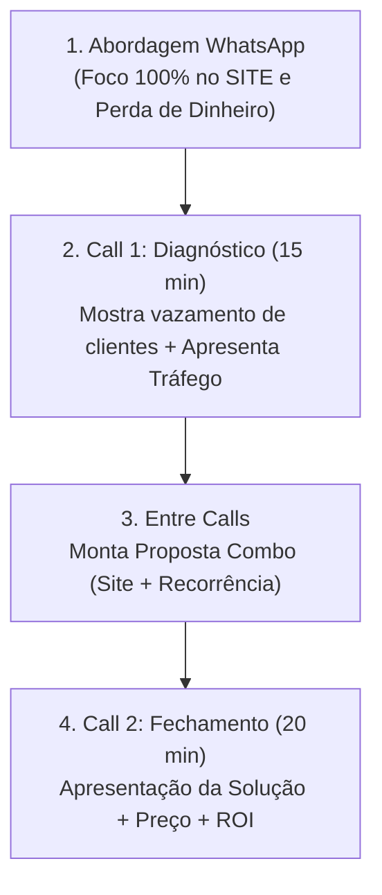

# Playbook de Vendas Consultivas — Pinas (@pinas.studio)
> **Método:** Cavalo de Tróia com Quick Win + Fechamento em 2 Etapas (Diagnóstico ➔ Proposta)  
> **Responsável:** Kauê (@pinas.studio)  
> **Objetivo:** Acelerar contratos recorrentes (MRR de R$ 1.500 a R$ 2.500) para transição segura do CLT para 100% Pinas.

---

## 🧭 O Modelo Mental da Venda Consultiva

A maioria das agências comete o erro de abordar o dono do comércio tentando vender logo de cara (*"Trabalhamos com marketing e tráfego pago, quer fechar?"*). O cliente recebe 10 dessas por semana e ignora todas.

A nossa estratégia inverte a lógica:
1. **Entregar valor antes de pedir qualquer coisa (Reciprocidade):** Apontamos um erro técnico real e já entregamos a solução mastigada de presente.
2. **Tocar na dor financeira real (Para quem não tem site):** Mostramos que a falta de estrutura está custando dinheiro e enriquecendo o concorrente do lado.
3. **Dividir a venda em duas reuniões rápidas:**
   - **Call 1 (15 min):** Diagnóstico e Descoberta. O cliente vê na tela onde está perdendo clientes pro concorrente e se encanta com o novo site. Aqui você introduz a **Gestão de Tráfego** como o motor para encher essa nova página de clientes todo mês.
   - **Call 2 (20 min):** Apresentação da Proposta Combo (Site + Tráfego) e Fechamento.

---

## 📱 ETAPA 1: A Abordagem no WhatsApp (Pinas Prospector)

> **Regra de Ouro:** No primeiro contato frio, **NÃO fale de tráfego pago ou anúncios**. O dono do comércio já tem trauma de agências querendo cobrar mensalidade. O foco do WhatsApp é 100% no **SITE (o ativo visual, concreto e óbvio)**. A gestão de tráfego você vende dentro da Call!

### Cenário A: O Negócio JÁ TEM Site
* **O que você analisa antes:** O site no celular. 90% dos sites demoram para carregar, têm botões pequenos ou não direcionam direto para o WhatsApp.
* **A mensagem:**
> *"Opa, tudo bem? Falo com o responsável pela **{nome}**?*  
>  
> *Aqui é o Kauê, da Pinas (@pinas.studio).*  
>  
> *Tava pesquisando empresas de {nicho} aqui em {bairro} e entrei no site de vocês pelo celular.*  
>  
> *Vocês têm um negócio muito bom, mas notei umas falhas na estrutura do site que com certeza tão fazendo vocês perderem clientes todo dia. A pessoa entra, mas o site trava a decisão dela e ela acaba pulando pro concorrente da região. É cliente pronto batendo na porta e indo embora.*  
>  
> *Separei o que precisa ser ajustado pra destravar esses contatos no WhatsApp.*  
>  
> *Consegue 15 minutinhos essa semana pra um papo rápido no Meet? Te mostro na tela na prática, sem compromisso nenhum."*

---

### Cenário B: O Negócio NÃO TEM Site (A Dor Aguda / Dando cliente pro vizinho)
* **O que você analisa antes:** A empresa tem nota boa no Google Maps, mas não tem site próprio.
* **A mensagem:**
> *"Opa, tudo bem? Falo com o responsável pela **{nome}**?*  
>  
> *Aqui é o Kauê, da Pinas (@pinas.studio).*  
>  
> *Tava pesquisando empresas de {nicho} aqui em {bairro} e achei vocês no Google. Vocês têm ótimas avaliações, mas reparei numa coisa crítica: vocês não têm um site profissional próprio.*  
>  
> *Cara, você não tem ideia do tanto de cliente da nossa região que pesquisa no Google todo santo dia com dinheiro na mão, não acha um site de vocês e clica direto no concorrente do lado. Vocês tão praticamente dando cliente pronto de bandeja pra concorrência faturar.*  
>  
> *Separei uns pontos bem práticos de como resolver isso e fazer esse pessoal cair direto no seu WhatsApp.*  
>  
> *Consegue 15 minutinhos essa semana pra um papo rápido no Meet? Eu compartilho a tela e te mostro na prática, sem compromisso nenhum."*

---

## 📞 ETAPA 2: A Call 1 — Diagnóstico & Confiança (30 minutos)

> **Postura do Kauê:** Consultor médico. O médico não receita o remédio antes de perguntar onde dói e pedir exames. Deixe o dono falar 70% do tempo.

### Bloco 1: Abertura e Escuta Ativa (15 minutos)
Comece agradecendo o tempo e coloque o foco nele:
> *"Obrigado pelo tempo, [Nome]! Como te adiantei no WhatsApp, o meu objetivo hoje não é te empurrar nada. Eu quero primeiro entender como funciona a operação de vocês hoje, para ver se realmente faz sentido o que eu encontrei. Pode me contar um pouco de como vocês captam clientes hoje?"*

#### Perguntas-Chave para fazer durante a conversa:
1. **Canal Atual:** *"Hoje, a maioria dos clientes novos chega por indicação, pelo Instagram ou pelo Google?"*
2. **Gargalo de Atendimento:** *"Quando um cliente manda mensagem no WhatsApp de vocês, quem responde? Quanto tempo costuma demorar para dar retorno?"*
3. **Produto/Serviço Mais Lucrativo:** *"Qual é o serviço ou produto de vocês que tem a melhor margem de lucro ou ticket mais alto?"*
4. **Capacidade Operacional:** *"Se chegassem hoje 15 a 20 novos clientes qualificados por mês, a estrutura de vocês daria conta de atender?"*
5. **Meta do Dono:** *"O que vocês mais querem destravar nos próximos 3 a 6 meses no negócio?"*

*👉 **Dica de Ouro:** Anote as palavras exatas que o cliente usar (ex: "o WhatsApp fica bagunçado", "o concorrente X tá pegando tudo", "cliente só pede preço e some"). Você vai usar essas mesmas palavras na proposta da Call 2!*

---

### Bloco 2: Revelação dos Problemas e Mockup Visual (10 minutos)
Agora compartilhe a tela:
1. **Mostre os pontos cegos encontrados:**
   - Abra a pesquisa do Google da região dele e mostre o concorrente que aparece no topo com anúncio e site moderno.
   - Mostre o site atual dele (se tiver) e aponte: lentidão no 4G, falta de botão flutuante de WhatsApp, texto confuso, falta de prova social.
2. **Mostre como deveria ser a solução (O Mockup):**
   - Abra os slides da Pinas (`/slides`) ou uma prévia de página moderna e responsiva.
   - Mostre: cabeçalho com proposta clara de valor, botão direto para o WhatsApp com mensagem pré-configurada, depoimentos e fotos reais da equipe/ambiente.
   - Diga: *"Olha a diferença da percepção de valor quando o seu cliente cai numa estrutura como essa aqui..."*

---

### Bloco 3: Fechamento da Reunião 1 (Gancho para a Call 2 - 5 minutos)
> **NUNCA passe preço na Call 1.** Se o cliente perguntar: *"Quanto custa isso?"*, responda:
>  
> *"Como eu te mostrei, eu não trabalho com pacotes de prateleira genéricos. Agora que eu entendi a sua rotina, o seu gargalo no atendimento e que o seu foco é faturar mais com [serviço lucrativo que ele mencionou], eu vou sentar hoje, desenhar um plano sob medida com o escopo exato para o seu momento e calcular o investimento.*  
>  
> *Podemos marcar 20 minutinhos na [quinta ou sexta-feira] para eu te mostrar essa proposta detalhada? Que horário fica melhor para você?"*

---

## 🛠️ ETAPA 3: O Entre-Calls (Estruturação da Proposta)

Entre a Call 1 e a Call 2, monte uma proposta direta e enxuta (1 a 3 páginas ou apresentação de slides) contendo:
1. **Diagnóstico Resumido:** Relembrando o que ele falou na Call 1.
2. **O Escopo de Entrega (O que a Pinas vai fazer):**
   - **Pilar 1 - Estrutura:** Criação de Site / Landing Page de Alta Conversão com botão integrado ao WhatsApp.
   - **Pilar 2 - Tráfego Pago:** Gestão de Campanhas de Google Ads (fundo de funil, quem já quer comprar) e/ou Meta Ads (Instagram).
   - **Pilar 3 - Otimização Comercial:** Ajuste dos links, templates de atendimento rápido no WhatsApp para evitar perda de leads.
3. **Precificação Ancorada:**
   - **Setup de Estrutura (Site/LP):** R$ 1.200 a R$ 2.000 (taxa única ou diluída).
   - **Gestão Mensal de Tráfego & Manutenção (MRR):** R$ 1.500 a R$ 2.000/mês.
   - **Opção Combo (Mais recomendada):** Setup + Gestão Mensal com desconto no pacote.

---

## 🤝 ETAPA 4: A Call 2 — Apresentação da Proposta & Fechamento (20 minutos)

### Roteiro da Call 2:

#### 1. Recapitulação (3 minutos):
> *"[Nome], na nossa última conversa você me contou que hoje o maior desafio é [dor que ele falou, ex: depender de indicação e perder clientes no WhatsApp]. Com base nisso, eu montei uma estratégia pensada especificamente para a realidade da {nome}."*

#### 2. Apresentação da Solução (10 minutos):
* Passe pelos 3 pilares da entrega (Site de Alta Conversão + Google Ads + Otimização de Atendimento).
* Destaque que a Pinas cuida de tudo de ponta a ponta: do criativo e do código até a otimização dos cliques diários.

#### 3. Ancoragem de Valor e ROI (5 minutos):
> *"O investimento para a gente implementar toda essa estrutura e gerenciar as campanhas é de R$ [Valor]/mês.*  
>  
> *Se a gente parar para analisar: com o seu ticket médio de R$ [Valor do cliente], se esse sistema colocar apenas **2 ou 3 novos clientes no mês** dentro da sua empresa, a assessoria já se pagou completamente e todo o resto é lucro limpo no seu bolso."*

#### 4. O Fechamento Direto:
> *"Faz sentido começarmos a estruturação já essa semana para colocarmos isso no ar o quanto antes?"*

---

## 🛡️ Como Contornar as Principais Objeções

| Objeção | Resposta do Kauê |
| :--- | :--- |
| **"Achei caro / Estou sem verba agora"** | *"Eu super entendo o cuidado com o caixa. Mas na prática, não ter essa estrutura está custando mais caro todo mês, porque os clientes da sua região continuam pesquisando no Google e caindo no concorrente. O nosso foco aqui não é custo, é uma máquina de colocar dinheiro no seu caixa que se paga nos primeiros clientes."* |
| **"Já fiz tráfego/site antes e não funcionou"** | *"Provavelmente quem fez para você cometeu um dos dois erros clássicos: mandou tráfego para um site lento e confuso, ou fez anúncios genéricos sem acompanhar quem chama no WhatsApp. Na Pinas nós alinhamos os anúncios com a página e o seu atendimento, garantindo que o lead que chega seja qualificado e pronto para fechar."* |
| **"Preciso conversar com meu sócio/esposa"** | *"Com certeza, decisão em parceria é fundamental. Que tal marcarmos 15 minutos amanhã com o seu sócio presente na chamada? Assim eu mostro a tela e os pontos técnicos direto para ele e tiro qualquer dúvida na hora."* |

---

## 📋 Checklist Rápido para Ter na Segunda Tela:

- [ ] Telefone do lead aberto com link corrigido gerado no Pinas Prospector
- [ ] Aba do Google Maps da região dele aberta mostrando a concorrência
- [ ] Aba dos Slides da Pinas (`http://localhost:3333/slides`) aberta para demonstrar autoridade
- [ ] Bloco de notas para registrar as dores e o ticket médio durante a Call 1
- [ ] Calendário/Google Agenda aberto para travar o horário da Call 2 antes de desligar
